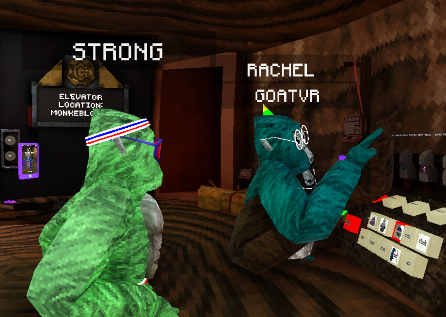

# MinecraftNametags
A BepInEx mod for Gorilla Tag that adds Minecraft styled nametags above player's heads

## Installation
1. Download the latest `MinecraftNametags.dll` from the [Releases page](https://github.com/struuct/MinecraftNametags/releases)
2. Place the `MinecraftNametags.dll` file in your `BepInEx/plugins` folder
3. Launch the game, when you join a room, all players should have the minecraft nametags above them

## Additional Info
If you want more mods like this and more exclusive mods that aren't available on my GitHub, join my [Discord server](https://struct.fyi/discord)

Original mod by [Ecstatic](https://thunderstore.io/c/gorilla-tag/p/Estatic/), all I did was port it to BepInEx and remove the random identifier things and paintbrawl things (i also removed the outline because that looked nothing like minecraft)
